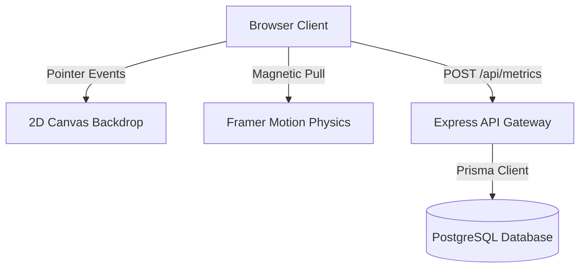

# TDD — Portfolio Redesign & Metric Ingestion Architecture

| Field        | Value                                                           |
| ------------ | --------------------------------------------------------------- |
| Tech Lead    | @MeghrajGoudThigulla                                            |
| Status       | Approved                                                        |
| Tech Stack   | Next.js, Express, Prisma, PostgreSQL, Vitest, Tailwind CSS, Canvas |
| Created      | 2026-08-24                                                      |
| Last Updated | 2026-08-24                                                      |

---

## 1. Context

This document outlines the architecture for the personal portfolio workspace modernization. The workspace consists of a static Next.js frontend hosted on Firebase Hosting, and an Express 5 backend hosted on Render/Railway. The redesign shifts the site from a generic SaaS layout to a premium editorial theme utilizing pointer interaction physics, distance-reactive backgrounds, and custom blend cursors, supported by a structured tracking system that measures visitor engagement and performance metrics.

---

## 2. Problem Statement & Motivation

### Problems We're Solving
* **Visitor Engagement Gaps:** Classic portfolios lack visual feedback, leading to high bounce rates from technical recruiters.
* **Lack of Data-Driven Evidence:** Traditional CVs and portfolios make claims about performance without measurable verification (such as load timings).
* **Static Redundancy:** Standard grid cards feel generic and fail to represent custom component design depth or domain-level ownership.

### Impact of NOT Solving
* Technical recruiters spend less than 10 seconds scanning a profile. Without an immediate hook (like pointer attraction physics) and structured project storytelling, candidate depth is missed.

---

## 3. Scope

### ✅ In Scope (V1)
* **Editorial Redesign:** Sizing typography using fluid `clamp()` math, custom pointer followers with `mix-blend-difference` blending, and fading border separators.
* **Distance-Reactive Canvas Dot Grid:** A 2D HTML5 Canvas backdrop recalculating node size on cursor position changes.
* **Engagement & Timing Metrics:** REST API tracking for card expansions (`case_expand`), badge hover impressions (`badge_impression`), and client-side mount timings (`roi_calculator_loaded`).
* **Toast Notification Engine:** A spring-animated portal stack managing client feedback.

### ❌ Out of Scope
* **User Authentication:** No login or dashboard views are provided on the static frontend.
* **Horizontal Database Scaling:** Rate limits and analytics accumulation are handled inside a single primary PostgreSQL server without replication.

---

## 4. Technical Solution

### Architecture Overview



### Data Flow (Metrics Ingestion)
1. The client navigates to the landing page.
2. The ROI Calculator component mounts and computes the delta from `navigationStart` in milliseconds.
3. A non-blocking asynchronous `POST /api/metrics/load-time` request is sent to the backend.
4. The Express endpoint validates parameters, confirms rate limits (via client IP caching), and commits the metrics through Prisma.

### API Contracts

#### `POST /api/metrics/load-time`
Ingests page load and component initialization latencies.

**Request Schema:**
```json
{
  "eventName": "roi_calculator_loaded",
  "timingMs": 420
}
```

**Response Schema (201 Created):**
```json
{
  "success": true,
  "timestamp": "2026-08-24T12:00:00.000Z"
}
```

---

## 5. Risks

| Risk | Impact | Probability | Mitigation |
|---|---|---|---|
| Canvas rendering performance lags on mobile devices | Medium | Medium | Implement pointer media queries and disable custom cursor tracking on coarse pointers (touch screens). |
| Analytics endpoints bombarded with spam | High | Medium | Enforce Express backend rate limiting using IP-based request windows (`RATE_LIMIT_MAX`). |
| Database connection pool exhaustion | High | Low | Enable Postgres connection pooling and set strict database connection timeout configurations in Prisma schema. |

---

## 6. Security Considerations

* **Rate Limiting:** Protects the metrics ingestion gateway from request floods using `RATE_LIMIT_WINDOW_MS` configurations.
* **CORS Policies:** Configured on the Express backend via `CORS_ORIGINS` to accept requests solely from your verified domain (`https://meghraj-portfolio.web.app/` or local dev environments).
* **Database SSL:** Configured with strict CA checks (`rejectUnauthorized: true` where supported) to defend against wire interception.

---

## 7. Testing Strategy

* **Frontend Unit Tests (Vitest + JSDOM):** 
  * Mock `framer-motion` via a dynamic Proxy trap in `test/setup.ts` to suppress JSDOM rendering errors for tags like `motion.section` or `motion.article`.
  * Verify validation feedback patterns and toast alerts inside `ContactForm.test.tsx` without generating duplicate elements.
* **Backend Testing:** Smoke-test metrics endpoints manually and verify database schema migrations are applied successfully before server startup.
